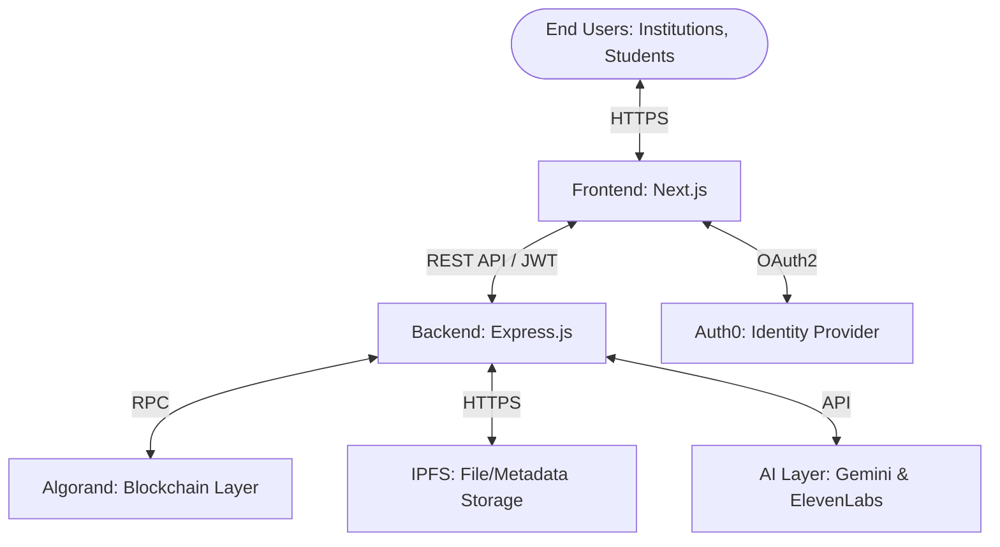

# CredX System Architecture

CredX is built on a modern, decentralized architecture that bridges the gap between traditional web services and the Algorand blockchain. This document outlines the core components and data flow of the platform.

---

## 🏗️ High-Level Architecture

---

## 🧩 Core Components

### 1. Frontend Layer (Next.js)
The frontend serves as the primary interface for both institutions and students.
- **Auth0 SDK**: Handles secure user authentication and session management.
- **Dynamic Dashboards**: Role-based access control (RBAC) ensures users see relevant tools (Issuance for Institutions, Retrieval for Students).
- **Public Verification**: A lightweight, search-optimized engine for verifying credentials without logging in.

### 2. Backend Layer (Express.js)
The backend acts as an orchestrator, managing complex flows that involve blockchain and AI.
- **Blockchain Service**: Interfaces with Algorand via `algosdk` to mint ASAs and execute smart contracts.
- **AI Insights Service**: Processes credential data through Google Gemini to generate narrative summaries.
- **Voice Synthesis Service**: Converts AI-generated text into professional audio files using ElevenLabs.
- **Metadata Management**: Follows the **ARC-3** standard to ensure on-chain NFT metadata is structured and verifiable.

### 3. Blockchain Layer (Algorand)
Algorand provides the trust and transparency layer for the entire system.
- **ASAs (NFTS)**: Represent individual credentials. Each asset is unique and contains a URL/Hash pointing to its off-chain metadata.
- **Smart Contracts**:
  - `registry`: Manages the list of verified educational institutions.
  - `credential_manager`: Handles the logic for credential issuance, revocation, and status updates.

### 4. Storage & AI Layer
- **IPFS (Pinata)**: Distributed storage for raw credential documents (PDFs) and metadata (JSON).
- **Google Gemini**: Performs deep analysis of credential content to detect fraud and generate summaries.
- **ElevenLabs**: Generates professional narrations for an enhanced user experience.

---

## 🔄 Data Flow: Credential Issuance

1. **Upload**: An institution uploads a student's record (PDF) via the dashboard.
2. **Metadata Construction**: The Backend uploads the file to **IPFS**, constructs a JSON metadata object following **ARC-3**, and uploads it to IPFS as well.
3. **Minting**: The Backend signs a transaction to mint a new **ASA** on Algorand. The asset URL is set to the IPFS CID of the metadata.
4. **AI Enrichment**: Simultaneously, **Gemini** analyzes the metadata to create a professional summary, which is then narrated by **ElevenLabs**.
5. **Notification**: Once the transaction is confirmed on-chain, the credential asset ID is returned to the user, and the record is instantly available for verification.

---

## 📈 Database Schema (Off-chain Cache)
While the source of truth is the blockchain, the backend maintains a performance cache (JSON-based `userStore.js`) for:
- User Roles (ISSUER, STUDENT, ADMIN)
- Institution Profiles
- Local Transaction History

---

## 🛠️ Infrastructure
- **Serverless**: Optimized for Vercel Functions.
- **Node Management**: Uses public Algorand Testnet nodes (Algonode/PureStake).
- **Decentralized Storage**: Relies on Pinata for global IPFS pinning.